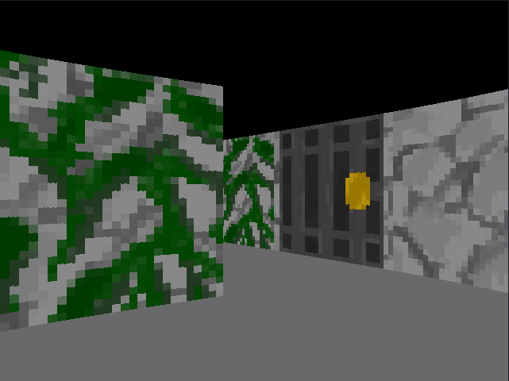

# Maze Game
A DDA-based raycaster built with Monogame where you can explore a randomly generated maze to find an exit

## Screenshots

## Controls
- `W, A, S, D`: Move Around
- `L & R Arrow Keys`: Rotate Camera
- `M`: Show map on console

## Note: This is a work in progress
Some things left to do:
- Actual game logic
- Distance shadowing
- Collision
