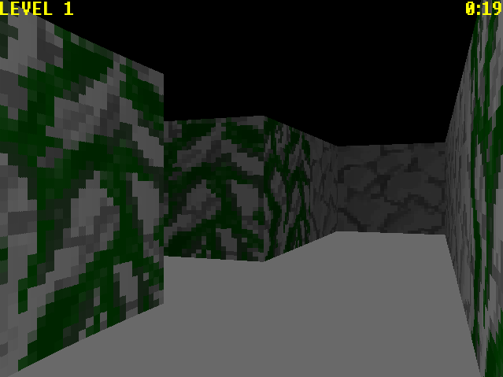
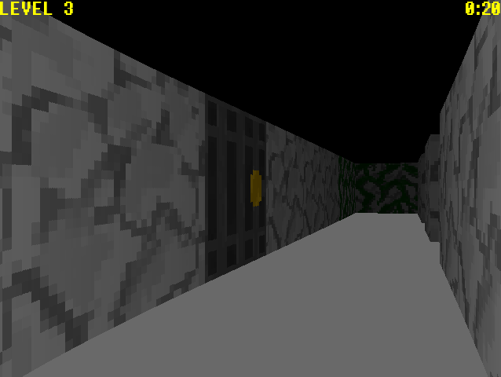

# Maze Game
A DDA-based raycaster built with Monogame where you can explore a randomly generated maze to find an exit

## Screenshots

## Controls
- `W, A, S, D`: Move Around
- `L & R Arrow Keys`: Rotate Camera
- `M`: Show map on console once (Try your best not to use it though!)
